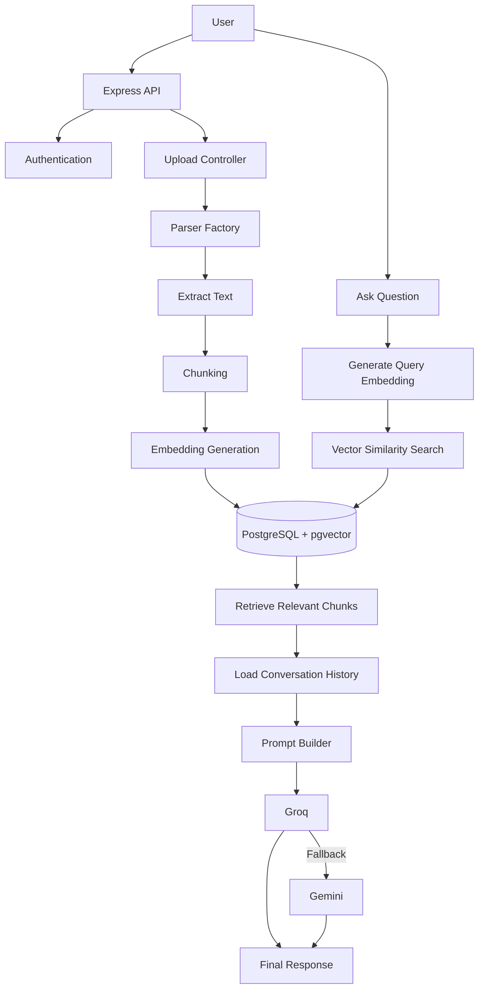

# Conversational RAG-Based Question Answering System

A backend application built with **Node.js** and **Express.js** that enables users to upload documents and ask natural language questions about their content using **Retrieval-Augmented Generation (RAG)**.

The system retrieves the most relevant document chunks through vector similarity search and generates context-aware responses using Large Language Models, while maintaining conversational memory across chat sessions.

---

## Features

- JWT Authentication
- Secure Document Upload
- Multi-Format Document Parsing
- Automatic Text Chunking
- Local Embedding Generation
- Vector Similarity Search (pgvector)
- Prompt Engineering
- Conversational Chat Memory
- File-Specific Search
- Global Search Across User Documents
- Groq Integration
- Gemini Fallback Integration

---

## Tech Stack

**Backend**
- Node.js
- Express.js

**Databases**
- MongoDB
- PostgreSQL
- pgvector

**AI & NLP**
- Transformers.js
- BAAI/bge-small-en-v1.5
- Groq API
- Google Gemini API

**Authentication**
- JSON Web Token (JWT)

**File Upload**
- Multer

**Supported File Types**
- PDF
- DOCX
- XLSX
- HTML
- Markdown

---

## System Architecture



---

## Project Workflow

The application follows a complete Retrieval-Augmented Generation (RAG) pipeline.

```text
Upload Document
      │
      ▼
Store Metadata (MongoDB)
      │
      ▼
Parse Document
      │
      ▼
Extract Text
      │
      ▼
Chunk Text
      │
      ▼
Generate Embeddings
      │
      ▼
Store Chunks & Embeddings (PostgreSQL)
      │
      ▼
───────────────────────────────────────

User Asks Question
      │
      ▼
Generate Query Embedding
      │
      ▼
Similarity Search
      │
      ▼
Retrieve Relevant Chunks
      │
      ▼
Load Conversation History
      │
      ▼
Build Prompt
      │
      ▼
Groq
      │
      ├──────────────► Success
      │
      ▼
Gemini (Fallback)
      │
      ▼
Save Assistant Response
      │
      ▼
Return Final Answer
```

---

## Project Structure

```text
src
│
├── config
├── controllers
├── middleware
├── models
├── parsers
├── routes
├── services
│   ├── chat
│   ├── chunking
│   ├── embeddings
│   ├── llm
│   ├── prompt
│   └── vectorStore
│
└── app.js
```

---

## Installation

Clone the repository

```bash
git clone <repository-url>
```

Move into the project directory

```bash
cd <project-folder>
```

Install dependencies

```bash
npm install
```

Run the development server

```bash
npm run dev
```

Or start the application

```bash
npm start
```

---

## Environment Variables

Create a `.env` file in the project root with the following variables:

```env
# Server
PORT=

# MongoDB
MONGO_URI=

# Authentication
JWT_SECRET=

# PostgreSQL (pgvector)
POSTGRES_URL=

# LLM Providers
GROQ_API_KEY=
GEMINI_API_KEY=
```

---

## API Overview

| Method | Endpoint              | Description                             |
|--------|------------------------|------------------------------------------|
| POST   | `/api/auth/register`   | Register a new user                     |
| POST   | `/api/auth/login`      | Authenticate user                       |
| POST   | `/api/files/upload`    | Upload a document                       |
| POST   | `/api/chat`             | Ask questions about uploaded documents  |

---

## Example Workflow

1. Register a new account.
2. Log in to receive a JWT token.
3. Upload one or more supported documents.
4. The system extracts and processes the document text.
5. Text is divided into chunks.
6. Embeddings are generated locally.
7. Chunks and embeddings are stored in PostgreSQL.
8. Ask questions about the uploaded documents.
9. The system retrieves the most relevant chunks.
10. A prompt is built using the retrieved context and conversation history.
11. Groq generates the response.
12. If Groq is unavailable, Gemini automatically handles the request.
13. The assistant's response is stored to support future conversations.

---

## Future Improvements

- Hybrid Search
- Semantic Chunking
- OCR Support
- Streaming Responses
- Response Citations
- Re-ranking Models
- Redis Caching
- Multi-Modal Document Support