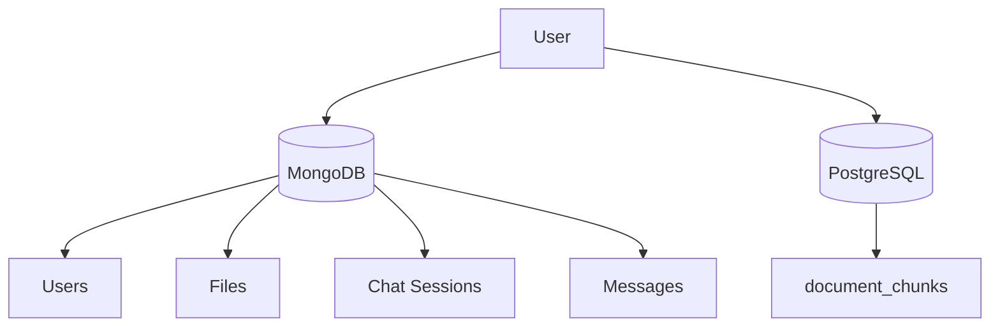
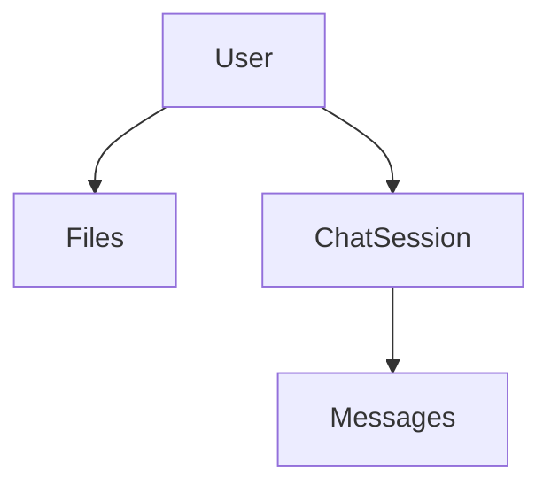
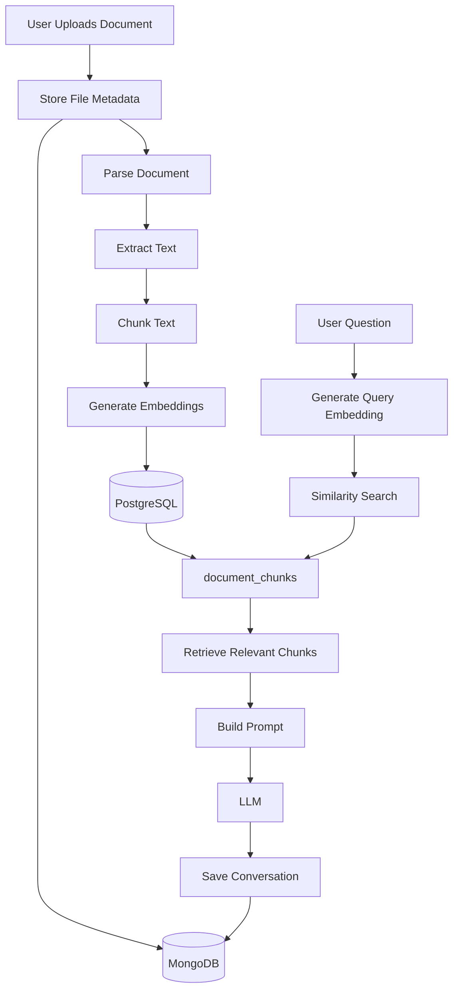

# Database Design Documentation

## 1. Introduction

This document describes the database architecture used in the Conversational Retrieval-Augmented Generation (RAG) system.

The project follows a **hybrid database architecture**, where each database is responsible for a specific type of data.

Instead of storing everything in a single database, MongoDB and PostgreSQL are used together to leverage the strengths of each technology.

---

## 2. Database Overview

The application uses two databases:

| Database              | Purpose                            |
| ---------------------- | ----------------------------------- |
| MongoDB               | Application data                   |
| PostgreSQL + pgvector | Vector storage and semantic search |

Each database has a clearly defined responsibility.

MongoDB manages user and application information, while PostgreSQL stores searchable document chunks and vector embeddings.

---

## 3. Why Hybrid Database Architecture?

Retrieval-Augmented Generation (RAG) systems manage two completely different categories of data.

### Application Data

Examples include:

- Users
- Uploaded files
- Chat sessions
- Conversation messages

This data changes frequently and fits naturally into a document-oriented database.

### Vector Data

Examples include:

- Document chunks
- Embeddings
- Similarity search

This data requires mathematical vector operations, indexing, and efficient nearest-neighbor search.

PostgreSQL with pgvector is designed for this purpose.

Separating these responsibilities results in a cleaner and more maintainable architecture.

---

## 4. Database Architecture



---

## 5. MongoDB Design

MongoDB stores all application-related data.

Collections currently used by the project include:

- Users
- Files
- Chat Sessions
- Messages

---

## 6. Users Collection

The Users collection stores registered user accounts.

Typical information includes:

| Field     | Description            |
| --------- | ----------------------- |
| _id       | Unique user identifier |
| username  | User name              |
| email     | User email             |
| password  | Encrypted password     |
| createdAt | Account creation time  |
| updatedAt | Last modification time |

Purpose:

- Authentication
- Authorization
- Ownership of uploaded files
- Ownership of chat sessions

---

## 7. Files Collection

Each uploaded document has a corresponding record inside the Files collection.

Typical fields include:

| Field        | Description                |
| ------------- | --------------------------- |
| _id          | File identifier            |
| originalName | Original uploaded filename |
| fileName     | Stored filename            |
| path         | Physical file location     |
| mimeType     | Document MIME type         |
| size         | File size                  |
| uploadedBy   | Owner of the file          |
| createdAt    | Upload timestamp           |

Purpose:

- File metadata
- File ownership
- Mapping uploaded documents to indexed chunks

The actual document text is **not stored** inside MongoDB. Only metadata is stored.

---

## 8. Chat Sessions Collection

Every conversation belongs to a chat session.

A chat session groups multiple user questions and assistant responses into one continuous conversation.

Typical fields:

| Field     | Description           |
| --------- | ----------------------- |
| _id       | Session identifier    |
| userId    | Owner of the session  |
| title     | Chat title (optional) |
| createdAt | Session creation time |
| updatedAt | Last activity time    |

Purpose:

- Organize conversations
- Continue previous chats
- Preserve conversational context

---

## 9. Messages Collection

Each individual message is stored separately.

Both user messages and assistant responses are stored.

Typical fields include:

| Field     | Description          |
| --------- | ---------------------- |
| _id       | Message identifier   |
| sessionId | Related chat session |
| role      | User or Assistant    |
| content   | Message text         |
| createdAt | Message timestamp    |

Purpose:

- Conversation history
- Context preservation
- Multi-turn interactions

---

## 10. MongoDB Relationships



Relationship summary:

- One user can upload multiple files.
- One user can own multiple chat sessions.
- One chat session contains multiple messages.

---

## 11. PostgreSQL Design

Unlike MongoDB, PostgreSQL stores searchable document information.

Only processed document chunks are stored.

The primary table used in the current implementation is:

- document_chunks

Each row represents a single chunk extracted from an uploaded document.

---

## 12. document_chunks Table

Each uploaded document is divided into multiple chunks.

Every chunk becomes one row inside PostgreSQL.

Typical structure:

| Column        | Description              |
| -------------- | -------------------------- |
| id            | Primary key              |
| mongo_file_id | Related MongoDB file     |
| user_id       | Owner of the chunk       |
| chunk_index   | Position inside document |
| content       | Chunk text               |
| embedding     | Vector embedding         |
| metadata      | JSON metadata            |

Purpose:

- Store searchable text
- Store vector embeddings
- Enable semantic retrieval

The embedding column uses the **pgvector** extension. This allows PostgreSQL to compare vectors efficiently during similarity search.

---

## 13. PostgreSQL Relationships

The relationship between MongoDB and PostgreSQL is established through the `mongo_file_id`.

```text
MongoDB File
      │
      ▼
mongo_file_id
      │
      ▼
document_chunks
```

Each uploaded file may produce dozens or even hundreds of document chunks. Each chunk references the same MongoDB file identifier.

---

## 14. Database Workflow

The following diagram illustrates how data moves between MongoDB and PostgreSQL during document processing and question answering.



---

## 15. Data Flow

The project uses both databases together throughout the RAG pipeline.

### Document Upload Flow

```text
User
   │
   ▼
Upload File
   │
   ▼
Store File Metadata (MongoDB)
   │
   ▼
Parse Document
   │
   ▼
Chunk Text
   │
   ▼
Generate Embeddings
   │
   ▼
Store Chunks (PostgreSQL)
```

During document upload:

- MongoDB stores only file metadata.
- PostgreSQL stores searchable document chunks and embeddings.

### Question Answering Flow

```text
User Question
      │
      ▼
Generate Query Embedding
      │
      ▼
Similarity Search (PostgreSQL)
      │
      ▼
Retrieve Relevant Chunks
      │
      ▼
Load Conversation History (MongoDB)
      │
      ▼
Build Prompt
      │
      ▼
LLM
      │
      ▼
Save Messages (MongoDB)
```

During question answering:

- PostgreSQL retrieves relevant document chunks.
- MongoDB provides previous conversation history.
- MongoDB stores newly generated messages.

---

## 16. Indexing Strategy

Efficient indexing is important for both databases.

### MongoDB

Indexes should be created on frequently queried fields.

Recommended indexes include:

| Collection    | Indexed Field |
| -------------- | --------------- |
| users         | email         |
| files         | uploadedBy    |
| chat_sessions | userId        |
| messages      | sessionId     |

These indexes improve lookup performance during authentication, file retrieval, and chat loading.

### PostgreSQL

The `document_chunks` table benefits from standard indexes.

Recommended indexes:

- user_id
- mongo_file_id
- chunk_index

These indexes improve filtering before vector similarity search.

### Vector Index

The embedding column should use a pgvector index for faster nearest-neighbor search.

Depending on dataset size, pgvector supports indexing methods such as:

- IVFFlat
- HNSW

For small datasets, sequential search is acceptable. For production systems with millions of vectors, HNSW is generally recommended due to its high retrieval performance.

---

## 17. Design Decisions

### Why MongoDB?

MongoDB stores flexible application data.

Documents such as users, uploaded files, chat sessions, and messages fit naturally into a document database. It also simplifies schema evolution as the application grows.

### Why PostgreSQL?

PostgreSQL provides reliable relational storage together with pgvector support.

This makes it suitable for semantic retrieval without introducing a separate vector database.

### Why pgvector?

Vector embeddings cannot be searched efficiently using traditional SQL comparisons.

The pgvector extension allows PostgreSQL to calculate vector distance directly inside SQL queries, enabling semantic similarity search over document embeddings.

### Why Store File Metadata in MongoDB?

File metadata belongs to the application's business domain.

Examples include:

- Original filename
- MIME type
- File owner
- Upload timestamp

Keeping this information separate from vector data simplifies database responsibilities.

### Why Store Chunks in PostgreSQL?

Chunks are optimized for retrieval.

Each chunk contains:

- Text content
- Embedding vector
- Metadata
- User reference
- File reference

This structure enables efficient semantic search while preserving document context.

### Why Use mongo_file_id?

The project stores file metadata in MongoDB but searchable chunks in PostgreSQL.

The `mongo_file_id` acts as the bridge between both databases, allowing the application to retrieve document metadata while performing vector search independently.

---

## 18. Scalability Considerations

The current implementation is suitable for small and medium-sized datasets. As the application grows, several optimizations can be introduced.

### MongoDB

Potential improvements:

- Replica Sets
- Sharding
- Read Replicas

### PostgreSQL

Potential improvements:

- Table Partitioning
- Connection Pooling
- HNSW Vector Indexes
- Query Optimization

### Application Layer

Future improvements include:

- Redis Caching
- Background Job Processing
- Batch Embedding Generation
- Streaming Responses

---

## 19. Future Improvements

Several enhancements can further improve the database architecture.

### MongoDB

- Soft delete support
- Audit logs
- User activity tracking

### PostgreSQL

- Metadata filtering
- Hybrid search
- Multiple embedding models
- Cross-encoder re-ranking

### Infrastructure

- Automated backups
- Monitoring
- High availability
- Multi-region deployment

---

## 20. Database Summary

| Database   | Purpose                                                     |
| ----------- | ------------------------------------------------------------ |
| MongoDB    | Users, uploaded files, chat sessions, conversation messages |
| PostgreSQL | Document chunks, embeddings, semantic retrieval             |

**MongoDB Collections**

- Users
- Files
- Chat Sessions
- Messages

**PostgreSQL Tables**

- document_chunks

---

## 21. Conclusion

The project follows a hybrid database architecture that separates application data from retrieval data.

MongoDB manages user-centric information such as authentication, uploaded file metadata, chat sessions, and conversation history.

PostgreSQL, enhanced with the pgvector extension, stores document chunks and embedding vectors, enabling efficient semantic similarity search.

This separation of responsibilities improves maintainability, scalability, and overall system organization while providing a solid foundation for future enhancements such as hybrid search, advanced indexing, and distributed deployments.