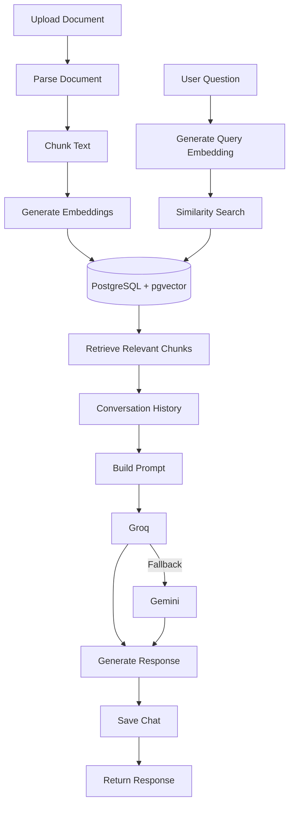

# RAG Pipeline Documentation

## 1. Introduction

This document explains the complete Retrieval-Augmented Generation (RAG) pipeline implemented in this project.

The purpose of this document is to describe how uploaded documents are processed, indexed, searched, and used to generate AI responses.

Unlike a traditional chatbot, this system does not rely only on the knowledge of a Large Language Model (LLM). Instead, it retrieves relevant information from user-uploaded documents before generating a response.

This approach improves response accuracy, reduces hallucinations, and enables users to ask questions about their own documents.

---

## 2. What is Retrieval-Augmented Generation (RAG)?

Retrieval-Augmented Generation (RAG) is an AI architecture that combines two components:

- Information Retrieval
- Large Language Model

Instead of asking the language model to answer directly, the system first searches for relevant information inside the uploaded documents.

The retrieved information is then included in the prompt before sending it to the language model.

The language model generates its response using the retrieved context rather than relying only on its pre-trained knowledge.

---

## 3. High-Level Architecture

The complete workflow of this project is shown below.



---

## 4. Complete Pipeline

The application is divided into two independent pipelines.

### Document Processing Pipeline

Responsible for preparing uploaded documents for retrieval.

```
Upload Document
        │
        ▼
Store Metadata
        │
        ▼
Parse Document
        │
        ▼
Extract Text
        │
        ▼
Chunk Text
        │
        ▼
Generate Embeddings
        │
        ▼
Store Chunks & Embeddings
```

### Question Answering Pipeline

Responsible for answering user questions.

```
User Question
        │
        ▼
Generate Query Embedding
        │
        ▼
Similarity Search
        │
        ▼
Retrieve Relevant Chunks
        │
        ▼
Load Conversation History
        │
        ▼
Build Prompt
        │
        ▼
LLM
        │
        ▼
Save Response
        │
        ▼
Return Final Answer
```

---

## 5. Document Processing Pipeline

The document processing pipeline is executed only once for each uploaded file.

Its objective is to transform an uploaded document into searchable vector embeddings.

After processing is completed, the document becomes available for semantic search.

The pipeline consists of six major stages:

1. Upload Document
2. Store Metadata
3. Parse Document
4. Chunk Text
5. Generate Embeddings
6. Store Chunks

---

## 6. Upload Document

The process starts when a user uploads a document through the upload endpoint.

Currently supported document formats include:

- PDF
- DOCX
- XLSX
- HTML
- Markdown

The uploaded file is temporarily stored on disk using Multer before further processing begins.

After a successful upload, the backend immediately starts the indexing process.

---

## 7. Store File Metadata

Before processing the document, the application stores basic file information inside MongoDB.

Metadata stored includes:

- Original File Name
- Generated File Name
- File Path
- MIME Type
- File Size
- Upload Time
- Uploaded User

MongoDB stores only application-related information.

The actual searchable content is stored later inside PostgreSQL.

---

## 8. Document Parsing

Different document formats require different parsing techniques.

Instead of placing all parsing logic inside one service, the project uses a **Parser Factory**.

The Parser Factory automatically selects the correct parser according to the uploaded file extension.

Supported parsers include:

- PDF Parser
- DOCX Parser
- XLSX Parser
- HTML Parser
- Markdown Parser

Each parser performs the same responsibility:

- Read the document.
- Extract plain text.
- Return a cleaned text representation.

This creates a consistent input format for the remaining pipeline regardless of the uploaded document type.

---

## 9. Text Chunking

Language models cannot efficiently process large documents as one continuous block of text.

For this reason, the extracted document is divided into smaller pieces called **chunks**.

The project currently uses a Recursive Character Chunking strategy.

Current configuration:

| Setting       |          Value |
| ------------- | --------------: |
| Chunk Size    | 800 Characters |
| Chunk Overlap |  90 Characters |

Chunk overlap preserves context between neighbouring chunks and reduces information loss around chunk boundaries.

The output of this stage is an ordered collection of smaller text chunks ready for embedding generation.

---

## 10. Embedding Generation

Each generated chunk is converted into a dense numerical vector called an **embedding**.

The project performs embedding generation locally using **Transformers.js**.

Embedding Model:

**BAAI/bge-small-en-v1.5**

Every chunk produces exactly one embedding vector.

These embeddings capture the semantic meaning of the text rather than exact keyword matches.

Using the same embedding model for both documents and user queries ensures that similarity search operates within the same vector space.

---

## 11. Store Chunks in PostgreSQL

After embeddings are generated, every chunk is stored inside PostgreSQL.

The pgvector extension is used to store vector embeddings.

Each stored record contains:

- Mongo File ID
- User ID
- Chunk Index
- Chunk Content
- Embedding Vector
- File Metadata

This completes the document indexing process.

Once indexing finishes, the uploaded document becomes searchable through semantic vector search.

---

## 12. Document Processing Diagram


---

## 13. Question Answering Pipeline

After a document has been indexed, users can start asking questions about its content.

Unlike the document processing pipeline, this workflow is executed every time a user submits a new question.

The objective of this pipeline is to retrieve the most relevant information from the uploaded documents and generate an accurate, context-aware response.

The question answering pipeline consists of the following stages:

1. Receive User Question
2. Generate Query Embedding
3. Perform Vector Similarity Search
4. Retrieve Relevant Chunks
5. Load Conversation History
6. Build Prompt
7. Generate AI Response
8. Save Conversation
9. Return Final Response

---

## 14. Receive User Question

The process begins when a user submits a question through the chat endpoint.

Each request contains:

- User ID
- Session ID (optional for continuing an existing conversation)
- File ID (optional for searching within a specific document)
- User Question

Before any processing begins, the application validates the request to ensure that the required information is available.

---

## 15. Generate Query Embedding

The user's question is converted into a vector embedding using the same embedding model that was used during document indexing.

Embedding Model:

**BAAI/bge-small-en-v1.5**

Using the same model for both documents and user queries ensures that vectors exist in the same semantic space, allowing meaningful similarity comparisons.

Example flow:

```text
User Question
      │
      ▼
Embedding Model
      │
      ▼
Query Vector
```

---

## 16. Vector Similarity Search

Once the query embedding is generated, PostgreSQL performs semantic similarity search using the pgvector extension.

Instead of searching for exact keywords, the system compares the query vector against all stored document vectors.

Similarity is calculated using vector distance.

Only the most relevant chunks are retrieved.

Current retrieval configuration:

| Setting    | Value |
| ---------- | ----: |
| Top Chunks |     5 |

The retrieved chunks become the knowledge source for the language model.

---

## 17. Search Modes

The system supports two retrieval modes.

### File-Specific Search

When a File ID is provided, the search is limited to that specific document.

This allows users to ask questions about a single uploaded file.

### Global Search

When no File ID is provided, the search is performed across all documents uploaded by the current user.

This enables cross-document question answering.

---

## 18. Conversation Memory

A conversational chatbot should understand previous questions instead of treating every request as independent.

For this reason, the project stores conversation history in MongoDB.

Each conversation belongs to a chat session.

Each chat session contains multiple messages exchanged between the user and the assistant.

The system loads previous messages before generating a new response.

This allows users to ask follow-up questions naturally.

Example:

User:

> What are his technical skills?

Assistant:

> Java, SQL, Node.js

User:

> What is his experience level?

The second question does not mention "resume", yet the assistant understands the context because previous conversation history is included during prompt construction.

---

## 19. Prompt Building

The retrieved document chunks alone are not sufficient for generating a high-quality response.

The application combines three different sources of information:

- Conversation History
- Retrieved Document Chunks
- Current User Question

These components are merged into a structured prompt.

The prompt instructs the language model to:

- Use only the provided context.
- Ignore unsupported information.
- Avoid hallucinations.
- Produce clear and concise answers.
- Inform the user when the answer is unavailable.

Separating prompt construction into its own service makes prompt engineering easier to maintain and update.

---

## 20. Generate AI Response

After the prompt has been prepared, it is sent to the configured language model.

The application follows the following priority:

```text
Groq
   │
Success?
   │
 ┌─Yes────────► Return Response
 │
 No
 │
 ▼
Gemini
 │
 ▼
Return Response
```

Groq is used as the primary provider because of its fast inference speed.

Gemini acts as an automatic fallback provider to improve system availability.

This strategy ensures that users continue receiving responses even if one provider becomes unavailable.

---

## 21. Save Conversation

After the language model generates a response, both the user message and the assistant response are stored.

Each message is associated with a chat session.

Stored information includes:

- Session ID
- Sender (User / Assistant)
- Message Content
- Timestamp

Persisting conversations allows users to continue discussions later without losing previous context.

---

## 22. Return Final Response

Finally, the backend returns the generated answer to the client.

Example response:

```json
{
  "success": true,
  "data": {
    "sessionId": "...",
    "answer": "..."
  }
}
```

At this point, the complete question-answering cycle is finished.

---

## 23. Question Answering Diagram


---

## 24. Pipeline Summary

The complete Retrieval-Augmented Generation workflow implemented in this project can be summarized as follows:

```text
Upload Document
      │
      ▼
Parse Document
      │
      ▼
Chunk Text
      │
      ▼
Generate Embeddings
      │
      ▼
Store in PostgreSQL
      │
────────────────────────────────────────────
      │
User Question
      │
      ▼
Generate Query Embedding
      │
      ▼
Similarity Search
      │
      ▼
Retrieve Relevant Chunks
      │
      ▼
Conversation History
      │
      ▼
Prompt Builder
      │
      ▼
Groq / Gemini
      │
      ▼
Save Conversation
      │
      ▼
Return Response
```

---

## 25. Design Decisions

This section explains the architectural decisions made during the development of this project.

Each technology was selected based on its responsibility within the RAG pipeline.

### Why MongoDB?

MongoDB is used to store application-related data.

This includes:

- Users
- Uploaded file metadata
- Chat sessions
- Conversation messages

These entities naturally fit a document-oriented database because they contain flexible and hierarchical data.

MongoDB provides simple schema evolution and efficient storage for application data.

### Why PostgreSQL?

Document chunks and vector embeddings require efficient similarity search.

PostgreSQL was selected because it supports the **pgvector** extension, allowing vector embeddings to be stored and queried directly.

Using PostgreSQL also provides:

- ACID compliance
- Reliable indexing
- Strong querying capabilities
- Native vector search through pgvector

### Why Separate Databases?

The project follows a hybrid database architecture.

Each database is responsible for a different type of data.

| Database   | Responsibility                        |
| ---------- | -------------------------------------- |
| MongoDB    | Users, files, chat sessions, messages |
| PostgreSQL | Chunks, embeddings, vector search     |

Separating application data from vector data keeps the system modular and easier to maintain.

### Why Parser Factory?

Different document formats require different parsing logic.

Instead of writing one large parser, the project uses the Factory Pattern.

Benefits include:

- Easy to extend
- Cleaner architecture
- Single responsibility
- Better maintainability

Adding support for a new document format only requires implementing a new parser without changing the rest of the pipeline.

### Why Recursive Character Chunking?

Large documents cannot be embedded as a single block.

Recursive chunking divides the document into manageable pieces while preserving context through overlap.

Current configuration:

| Setting       |          Value |
| ------------- | --------------: |
| Chunk Size    | 800 Characters |
| Chunk Overlap |  90 Characters |

This configuration provided a good balance between retrieval quality and response accuracy during testing.

### Why Local Embeddings?

Embeddings are generated locally using:

**Transformers.js**

Embedding Model:

**BAAI/bge-small-en-v1.5**

Local embedding generation offers several advantages:

- No dependency on external embedding APIs
- Lower operational cost
- Better privacy
- Faster document indexing
- Full control over the embedding process

### Why Vector Search?

Traditional keyword search fails when users ask semantically similar questions using different words.

Vector search compares the semantic meaning of text instead of exact keywords.

This enables the system to retrieve relevant information even when different vocabulary is used.

### Why Conversation Memory?

Most real-world conversations contain follow-up questions.

Without conversation memory, every question would need to include complete context.

Conversation history allows the assistant to understand references to previous questions and generate more natural responses.

This creates a conversational experience instead of isolated question-answer interactions.

### Why Prompt Builder?

Prompt construction is isolated into a dedicated service.

Separating prompt engineering from business logic improves:

- Readability
- Maintainability
- Reusability

The prompt builder combines:

- Conversation history
- Retrieved document chunks
- Current question

before sending the request to the language model.

### Why Groq with Gemini Fallback?

The project integrates two language model providers.

Primary Provider:

- Groq

Fallback Provider:

- Google Gemini

If the primary provider fails or becomes unavailable, the system automatically switches to the fallback provider.

This improves system availability and provides a better user experience.

---

## 26. Current Limitations

Although the current implementation provides a complete RAG workflow, several limitations remain.

Current limitations include:

- Character-based chunking instead of semantic chunking.
- No OCR support for scanned documents.
- No response citations.
- No re-ranking model.
- Entire conversation history is loaded without summarization.
- Limited support for document formats.
- No streaming responses.
- No caching layer.

These limitations can be addressed in future versions.

---

## 27. Future Improvements

The project can be extended with several advanced RAG features.

### Retrieval Improvements

- Hybrid Search
- Semantic Chunking
- Metadata Filtering
- Cross-Encoder Re-ranking

### AI Improvements

- Streaming Responses
- Multi-turn Memory Optimization
- Better Prompt Templates
- Citation Generation
- Confidence Scoring

### Performance Improvements

- Redis Caching
- Background Processing
- Batch Embedding Generation
- Parallel Document Processing

### Document Support

- OCR for scanned PDFs
- Excel support improvements
- PowerPoint support
- Image understanding
- Audio transcription

### Infrastructure

- Docker Deployment
- Kubernetes
- CI/CD Pipeline
- Monitoring and Logging
- Cloud Deployment

---

## 28. Key Takeaways

This project demonstrates a complete Retrieval-Augmented Generation backend built using modern backend technologies.

Major capabilities include:

- Secure document upload
- Multi-format document parsing
- Automatic text chunking
- Local embedding generation
- PostgreSQL vector search
- Semantic document retrieval
- Conversation memory
- Prompt engineering
- LLM integration
- Automatic provider fallback

The modular service-based architecture allows each component of the pipeline to evolve independently, making the system easier to maintain and extend.

---

## 29. Conclusion

This project implements an end-to-end conversational Retrieval-Augmented Generation (RAG) system capable of answering questions based on user-uploaded documents.

The architecture combines MongoDB for application data, PostgreSQL with pgvector for semantic retrieval, local embedding generation for efficient indexing, and modern Large Language Models for response generation.

By separating document processing, retrieval, prompt construction, conversation management, and response generation into dedicated services, the application remains modular, scalable, and maintainable.

The current implementation provides a strong foundation that can be extended with advanced retrieval techniques, improved reasoning capabilities, and production-ready infrastructure in future versions.