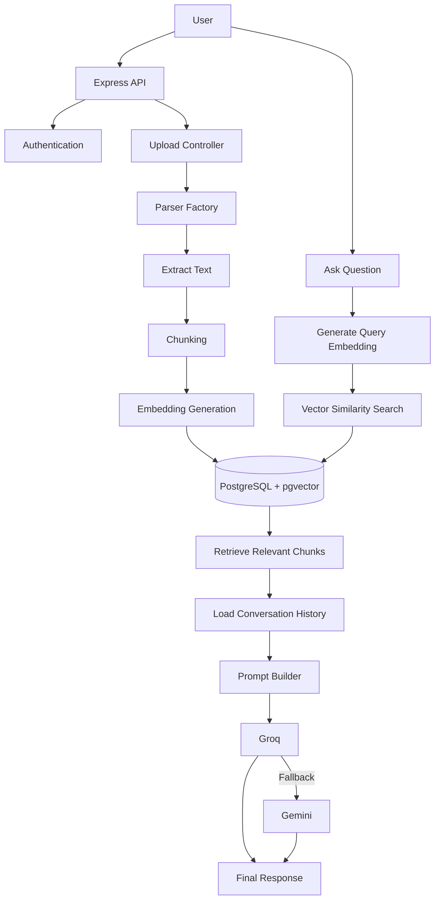

# Conversational RAG-Based Question Answering System

A backend system that lets users upload documents and have a real conversation about their content — powered by Retrieval-Augmented Generation (RAG), local embeddings, and vector similarity search.

Instead of dumping an entire document into an LLM's context window, this system breaks documents into meaningful chunks, embeds them, retrieves only the most relevant pieces for a given question, and generates grounded, context-aware answers — while remembering the conversation so far.

---

## Why this project

Most "chat with your PDF" tutorials stop at a single file and a single question. This system is built to handle **multiple documents per user**, **multi-turn conversations**, and **real failure scenarios** (LLM provider downtime, mixed file formats, per-user data isolation) — the parts that actually make a RAG system usable rather than a demo.

---

## Features

- **JWT Authentication** — secure, per-user access to documents and chats
- **Secure Document Upload** — validated uploads via Multer
- **Multi-Format Document Parsing** — PDF, DOCX, XLSX, HTML, Markdown, handled through a parser factory pattern
- **Automatic Text Chunking** — recursive, structure-aware splitting so context isn't broken mid-thought
- **Local Embedding Generation** — no external API calls needed just to embed text
- **Vector Similarity Search** — powered by PostgreSQL + pgvector
- **Conversational Chat Memory** — each session remembers prior turns, so follow-up questions work naturally
- **File-Specific & Global Search** — ask questions scoped to one document or across everything you've uploaded
- **LLM Fallback Handling** — Groq as primary provider, Gemini as automatic fallback if Groq is unavailable

---

## Tech Stack

| Layer | Technology |
|---|---|
| Backend | Node.js, Express.js |
| Relational / Metadata DB | MongoDB |
| Vector Storage | PostgreSQL + pgvector |
| Embeddings | Transformers.js — `BAAI/bge-small-en-v1.5` (runs locally) |
| LLM Providers | Groq API (primary), Google Gemini API (fallback) |
| Auth | JSON Web Tokens (JWT) |
| File Upload | Multer |

**Supported file types:** PDF · DOCX · XLSX · HTML · Markdown

### Why two databases?

MongoDB stores document and chat metadata (flexible, document-shaped data that doesn't need relational structure), while PostgreSQL + pgvector handles chunk embeddings and similarity search, where indexed vector operations matter. Each database is used for what it's actually good at, rather than forcing everything into one store.

---

## System Architecture



---

## How a Question Gets Answered

1. **Upload** — document metadata is stored in MongoDB
2. **Parse** — text is extracted based on file type via the parser factory
3. **Chunk** — text is split into overlapping, context-preserving segments
4. **Embed** — each chunk is converted into a vector locally (no external API call)
5. **Store** — chunks + embeddings are saved in PostgreSQL via pgvector
6. **Ask** — user's question is embedded the same way
7. **Retrieve** — the most similar chunks are pulled via vector similarity search
8. **Recall** — prior conversation turns are loaded for context
9. **Build Prompt** — retrieved chunks + chat history are assembled into a single prompt
10. **Generate** — Groq produces the answer; Gemini steps in automatically if Groq fails
11. **Persist** — the assistant's response is saved, so future questions stay in context

---

## Project Structure

```
src
│
├── config
├── controllers
├── middleware
├── models
├── parsers
├── routes
├── services
│   ├── chat
│   ├── chunking
│   ├── embeddings
│   ├── llm
│   ├── prompt
│   └── vectorStore
│
└── app.js
```

---

## Getting Started

```bash
# Clone the repository
git clone https://github.com/konain013/Rag-based-QA.git
cd Rag-based-QA

# Install dependencies
npm install

# Run in development mode
npm run dev

# Or start normally
npm start
```

### Environment Variables

Create a `.env` file in the project root:

```env
# Server
PORT=

# MongoDB
MONGO_URI=

# Authentication
JWT_SECRET=

# PostgreSQL (pgvector)
POSTGRES_URL=

# LLM Providers
GROQ_API_KEY=
GEMINI_API_KEY=
```

---

## API Overview

| Method | Endpoint | Description |
|---|---|---|
| POST | `/api/auth/register` | Register a new user |
| POST | `/api/auth/login` | Authenticate user |
| POST | `/api/files/upload` | Upload a document |
| POST | `/api/chat` | Ask questions about uploaded documents |

---

## Roadmap

Planned improvements, not yet implemented:

- Hybrid search (keyword + vector)
- Semantic chunking
- OCR support for scanned documents
- Streaming responses
- Response citations (source attribution)
- Re-ranking models
- Redis caching
- Rate limiting
- Multi-modal document support

---

