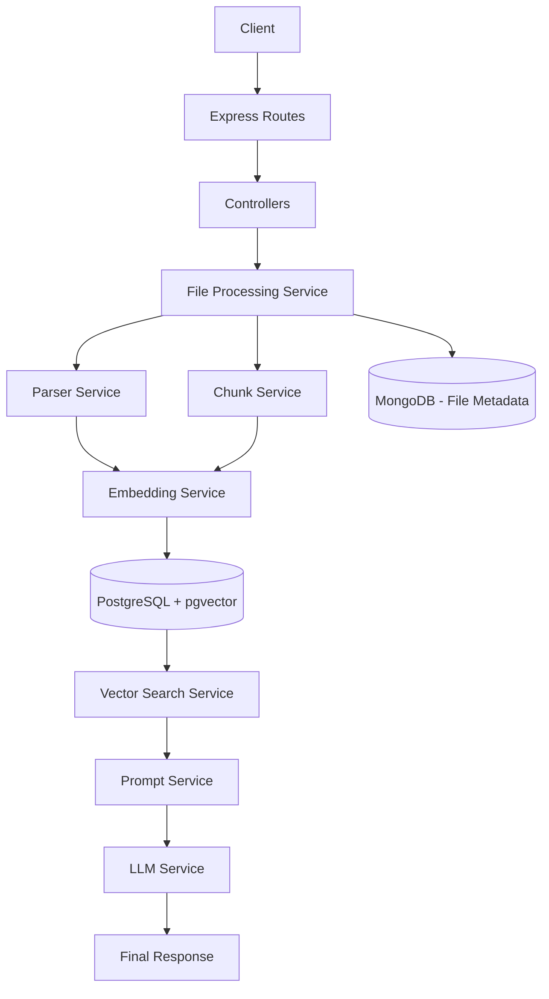

# System Architecture

## 1. Overview

The RAG Backend is designed using a modular architecture where each module has a single responsibility. This approach makes the project easier to maintain, test, and extend. Every service performs one specific task, allowing new features to be added without affecting existing functionality.

The system follows the Retrieval-Augmented Generation (RAG) workflow. It accepts documents from users, extracts and processes their content, generates vector embeddings, stores them in a vector database, retrieves the most relevant information based on a user's question, and finally uses a Large Language Model (LLM) to generate an accurate response.

---

## 2. Project Structure

```text
app.js

config/
controllers/
middleware/
models/
routes/
services/
│
├── chat/
├── chunking/
├── embeddings/
├── llm/
├── parsers/
├── prompt/
└── vectorStore/

utils/
validators/
```

---

## 3. High-Level Architecture



---

## 4. Architecture Components

### 4.1 Application Entry Point (app.js)

The `app.js` file is the entry point of the application. It initializes the Express server, loads configuration files, connects to the databases, registers middleware, loads API routes, and starts the application.

**Responsibilities**

- Initialize Express application
- Configure middleware
- Connect MongoDB
- Connect PostgreSQL
- Register routes
- Start the HTTP server

---

### 4.2 Routes

Routes define all available API endpoints. Each route receives an incoming request and forwards it to the appropriate controller.

**Responsibilities**

- Define API endpoints
- Apply middleware
- Forward requests to controllers

Routes do not contain business logic.

---

### 4.3 Controllers

Controllers handle incoming HTTP requests and outgoing HTTP responses.

A controller validates the request, calls the required service, and returns a JSON response to the client.

**Responsibilities**

- Receive requests
- Validate input
- Call business logic
- Return responses
- Handle exceptions

Controllers remain lightweight by delegating all processing to the service layer.

---

### 4.4 Middleware

Middleware executes before the controller and is responsible for handling common application functionality.

Examples include authentication, authorization, request validation, and centralized error handling.

**Responsibilities**

- User authentication
- Role authorization
- Input validation
- Error handling
- Request preprocessing

Keeping these concerns in middleware avoids duplicate code throughout the application.

---

### 4.5 Models

MongoDB models define the application's data structure for user-related information and uploaded file metadata.

MongoDB is used because this data is document-oriented and does not require vector operations.

**Stored Information**

- User details
- Uploaded file information
- File metadata
- Upload timestamps

---

## 5. Service Layer

The service layer contains the complete business logic of the application. Each service performs one clearly defined responsibility.

### 5.1 Parser Service

The Parser Service extracts readable text from uploaded documents.

Different parser implementations are available for different document formats.

**Supported File Types**

- PDF
- DOCX
- XLSX
- HTML
- Markdown

**Responsibilities**

- Detect file type
- Read file
- Extract text
- Clean extracted content
- Return plain text

The parser does not perform chunking or embedding generation.

---

### 5.2 Chunk Service

After extracting text, the Chunk Service divides the document into smaller pieces.

Smaller chunks improve semantic search accuracy while preserving context.

The project uses the **Recursive Character Text Splitter** because it creates balanced chunks without breaking important context.

**Responsibilities**

- Split text
- Preserve context
- Generate overlapping chunks
- Return chunk list

---

### 5.3 Embedding Service

The Embedding Service converts every text chunk into a numerical vector representation.

These vectors capture the semantic meaning of the text and are later used for similarity search.

The project uses the **BAAI/bge-small-en-v1.5** embedding model running locally through **Transformers.js**.

**Responsibilities**

- Load embedding model
- Generate embeddings
- Return vector representations

---

### 5.4 Vector Store Service

The Vector Store Service stores document chunks and their embeddings inside PostgreSQL with the pgvector extension.

Each stored record contains both textual and vector information.

**Stored Data**

- Chunk content
- Embedding vector
- Chunk index
- User ID
- File ID
- Metadata

This service is also responsible for retrieving similar vectors during question answering.

---

### 5.5 Prompt Service

The Prompt Service prepares the final prompt that will be sent to the Large Language Model.

It combines:

- User question
- Retrieved document chunks
- Prompt template

Separating prompt creation from other services makes prompt engineering easier to modify.

---

### 5.6 LLM Service

The LLM Service communicates with the language model.

After receiving the prepared prompt, it sends the request to the configured LLM and returns the generated response.

**Responsibilities**

- Receive prompt
- Call LLM
- Receive generated answer
- Return response

This design allows different LLM providers to be integrated with minimal changes.

---

### 5.7 Chat Service

The Chat Service coordinates the complete Retrieval-Augmented Generation workflow.

Instead of performing individual tasks itself, it orchestrates multiple services.

**Workflow**

1. Receive user question
2. Generate question embedding
3. Retrieve similar document chunks
4. Build prompt
5. Send prompt to LLM
6. Return final answer

This service acts as the central coordinator for the entire RAG pipeline.

---

## 6. Database Architecture

The project uses two databases because they serve different purposes.

### 6.1 MongoDB

MongoDB stores application-related data.

Examples:

- User accounts
- Uploaded file metadata

MongoDB is suitable because these records are document-based and frequently updated.

### 6.2 PostgreSQL with pgvector

PostgreSQL stores vector embeddings and document chunks.

Examples:

- Chunk text
- Embedding vectors
- Metadata
- User ID
- File ID

The pgvector extension enables efficient similarity search using vector distance calculations.

---

## 7. Data Flow

The complete document processing workflow is shown below.

```text
User Uploads File
        │
        ▼
Save Metadata in MongoDB
        │
        ▼
Extract Text (Parser)
        │
        ▼
Create Chunks
        │
        ▼
Generate Embeddings
        │
        ▼
Store Chunks & Embeddings
(PostgreSQL + pgvector)
```

When the user asks a question:

```text
User Question
      │
      ▼
Generate Question Embedding
      │
      ▼
Similarity Search
      │
      ▼
Retrieve Relevant Chunks
      │
      ▼
Create Prompt
      │
      ▼
Send Prompt to LLM
      │
      ▼
Generate Answer
      │
      ▼
Return Response
```

---

## 8. Design Principles

The project follows several software engineering principles to improve code quality and maintainability.

### 8.1 Single Responsibility Principle (SRP)

Each module performs only one task.

Examples:

- Parser extracts text.
- Chunk Service creates chunks.
- Embedding Service generates vectors.
- Prompt Service builds prompts.

This reduces complexity and improves maintainability.

### 8.2 Separation of Concerns

Routing, validation, business logic, database operations, and AI processing are separated into independent modules.

This makes debugging and testing much easier.

### 8.3 Modularity

Each component can be modified or replaced without affecting the rest of the system.

For example, a new embedding model or parser can be added without changing other services.

### 8.4 Scalability

The architecture supports future expansion.

New document formats, embedding models, vector databases, or LLM providers can be integrated with minimal code changes.

### 8.5 Maintainability

Keeping responsibilities separated makes the project easier to understand, debug, and extend over time.

---

## 9. Summary

The RAG Backend is built using a modular and scalable architecture that follows modern backend development practices. The system separates routing, business logic, document processing, vector storage, prompt generation, and LLM communication into independent services. This design improves readability, maintainability, scalability, and makes the project suitable for real-world Retrieval-Augmented Generation applications.